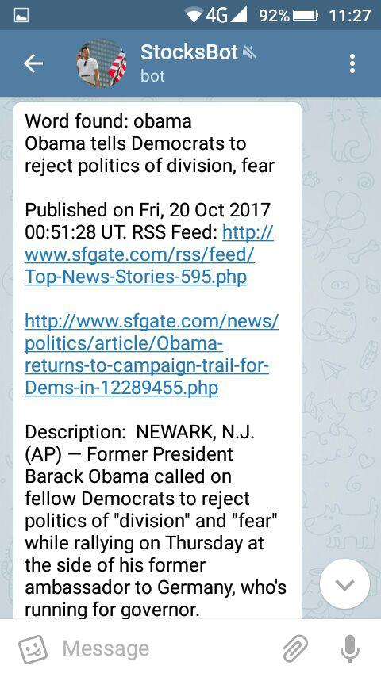

# News Notifier bot

Telegram bot in Kotlin, which allows you to subscribe to most recent news and articles. Then new publications are filtered according to your preferences and delivered via Telegram. 

When running on a server, bot regularly extracts new news from a list of sources. Sources are usually RSS-feeds. Then the bot determines the articles, which have been posted recently and delivers them to the subscribers.

Each user may specify range of topics he is interested in. It is done via manipulating with the bot and specifing a list of substrings. Then only news, containing one of substrins in the title or description are sent to the subscriber. 

Bot may be used to be immediately informed about up-to-date news and, for example, then recent public news may be used to do stocks trading.

Copyright 2017 Aleksandr Tukallo